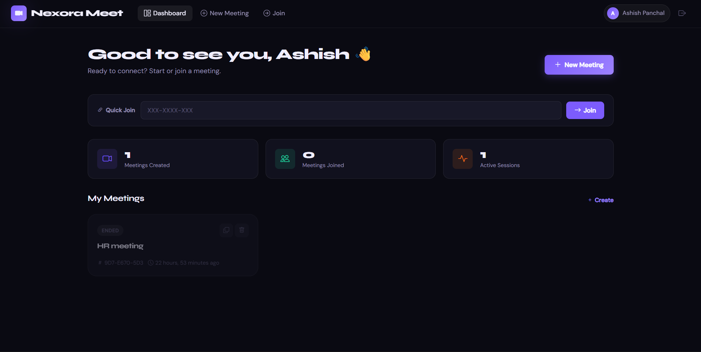
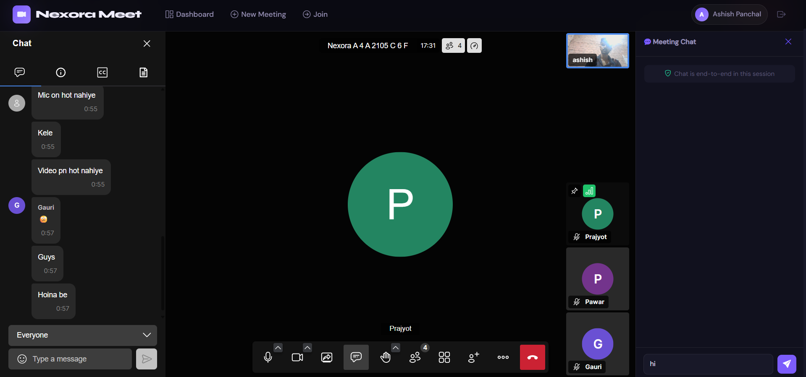
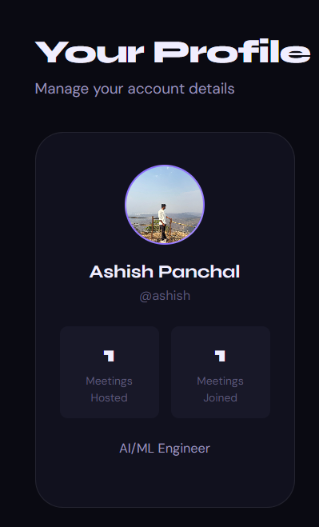
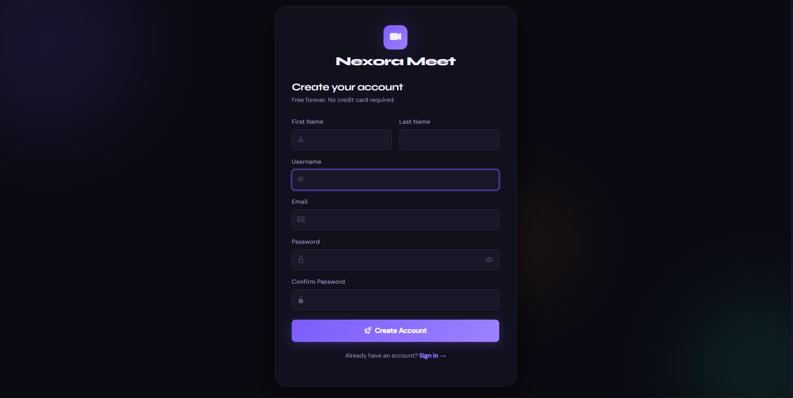
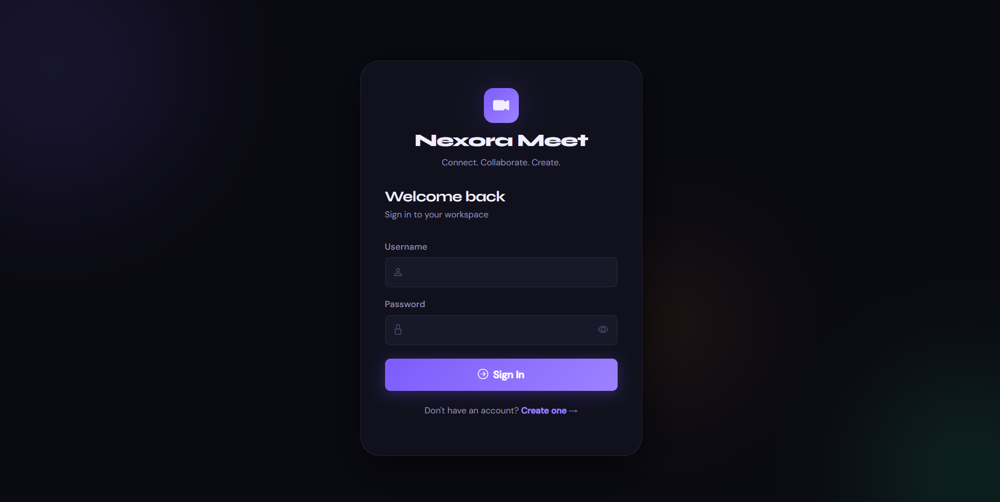
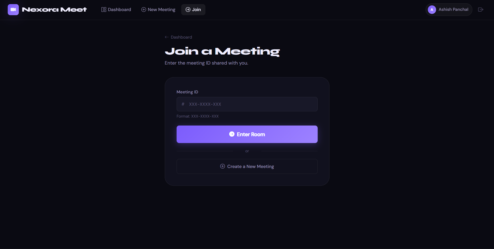

# 🚀 Nexora Meet

A modern real-time video conferencing platform built with Django, WebRTC technologies, WebSockets, and Redis. Nexora Meet enables users to create, join, and manage virtual meetings with live chat, authentication, and a sleek modern interface inspired by Zoom and Google Meet.

---

## 🌐 Live Demo

comming soon..

---

## ✨ Features

### 🔐 Authentication System

* User Registration
* Secure Login & Logout
* Email OTP Verification
* Forgot Password with OTP Verification
* Session-Based Authentication

### 🎥 Meeting Management

* Create New Meetings
* Join Meetings Using Meeting ID
* Copy Meeting Invitation Link
* Meeting Dashboard
* Meeting History

### 💬 Real-Time Chat

* Live Chat During Meetings
* WebSocket-Based Communication
* Instant Message Delivery
* Participant Messaging

### 📹 Video Conferencing

* Jitsi Meet Integration
* Audio Controls
* Video Controls
* Participant Management
* Meeting Room Interface

### 👤 User Profile

* Profile Management
* Profile Picture Upload
* Hosted Meetings Statistics
* Joined Meetings Statistics

### 📧 Email Services

* OTP Verification Emails
* Password Reset Emails
* Professional HTML Email Templates
* Brevo Email API Integration

### 🎨 Modern UI/UX

* Dark Theme Interface
* Responsive Design
* Modern Dashboard
* Smooth User Experience

---

# 📸 Screenshots

## 🏠 Dashboard



---

## 🎥 Video Conference Room



---

## 👤 User Profile



---

## 📝 Registration Page



---

## 🔐 Login Page



---

## 🚪 Join Meeting



---

# 🛠 Tech Stack

## Backend

* Python
* Django
* Django REST Framework

## Real-Time Features

* Django Channels
* WebSockets
* Redis

## Video Conferencing

* Jitsi Meet API

## Frontend

* HTML5
* CSS3
* Bootstrap 5
* JavaScript

## Database

* SQLite (Development)
* PostgreSQL (Production)

## Email Service

* Brevo Email API

## Deployment

* Render
* Railway
* GitHub

---

# 📂 Project Structure

```text
NexoraMeet/
│
├── accounts/
│   ├── models.py
│   ├── forms.py
│   ├── views.py
│
├── meetings/
│   ├── models.py
│   ├── views.py
│
├── chat/
│   ├── consumers.py
│   ├── routing.py
│
├── static/
│   ├── css/
│   ├── js/
│   └── images/
│
├── media/
│
├── templates/
│
├── screenshots/
│   ├── dashboard.png
│   ├── meeting-room.png
│   ├── profile.png
│   ├── register.png
│   ├── login.png
│   └── join-meeting.png
│
├── zoom_project/
│   ├── settings.py
│   ├── urls.py
│   ├── asgi.py
│
├── requirements.txt
├── manage.py
└── README.md
```

---

# ⚙️ Installation

## 1️⃣ Clone Repository

```bash
git clone https://github.com/your-username/NexoraMeet.git

cd NexoraMeet
```

---

## 2️⃣ Create Virtual Environment

```bash
python -m venv venv
```

### Windows

```bash
venv\Scripts\activate
```

### Linux / macOS

```bash
source venv/bin/activate
```

---

## 3️⃣ Install Dependencies

```bash
pip install -r requirements.txt
```

---

## 4️⃣ Create Environment Variables

Create a `.env` file:

```env
SECRET_KEY=your_secret_key

DEBUG=True

DATABASE_URL=your_database_url

REDIS_URL=your_redis_url

BREVO_API_KEY=your_brevo_api_key
```

---

## 5️⃣ Apply Migrations

```bash
python manage.py makemigrations

python manage.py migrate
```

---

## 6️⃣ Create Superuser

```bash
python manage.py createsuperuser
```

---

## 7️⃣ Run Development Server

```bash
python manage.py runserver
```

Open:

```text
http://127.0.0.1:8000
```

---

# 🚀 Deployment

## Render

### Build Command

```bash
pip install -r requirements.txt && python manage.py collectstatic --noinput && python manage.py migrate
```

### Start Command

```bash
daphne -b 0.0.0.0 -p $PORT zoom_project.asgi:application
```

### Environment Variables

```env
SECRET_KEY=
DATABASE_URL=
REDIS_URL=
BREVO_API_KEY=
```

---

# 🔒 Security Features

* CSRF Protection
* Session Authentication
* OTP Email Verification
* Password Validation
* Secure Environment Variables
* Django Security Middleware

---

# 🚀 Future Enhancements

* Screen Sharing
* Meeting Recording
* Meeting Scheduling
* Waiting Room Feature
* AI Meeting Notes
* Virtual Backgrounds
* Background Blur
* Push Notifications
* Mobile App Version

---

# 👨‍💻 Developer

### Ashish Panchal

AI/ML Engineer • Full Stack Developer

**Skills**

* Python
* Django
* Machine Learning
* Deep Learning
* Computer Vision
* Full Stack Development

---

# 🤝 Contributing

Contributions, issues, and feature requests are welcome.

Feel free to fork the repository and submit a pull request.

---

# ⭐ Support

If you found this project useful:

⭐ Star the repository

🍴 Fork the repository

🛠 Share your feedback

---

# 📜 License

This project is licensed under the MIT License.

---

<div align="center">

### Nexora Meet

Connect • Collaborate • Create

Built with ❤️ using Django, Redis, WebSockets & Jitsi Meet

</div>
